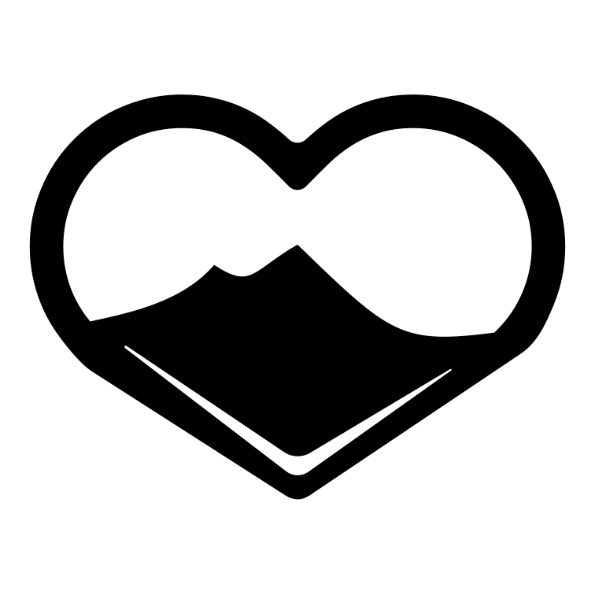
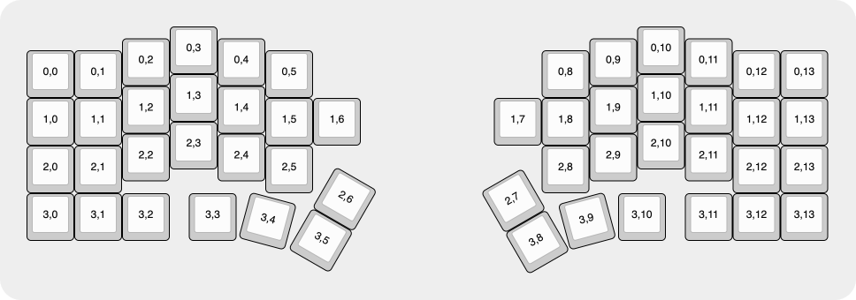
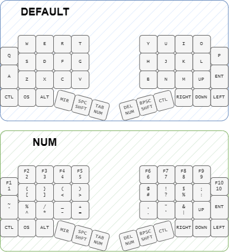

# Vesuveus - The Smol Ergonomic Mechanical Keyboard

  

Hey there! Welcome to Vesuveus, a cute and ergonomic mechanical keyboard! This little wonder is heavily inspired by the [nine-nano](https://github.com/bsag/nine-nano) by bsag and the [atreus](https://shop.keyboard.io/products/keyboardio-atreus) by keeboardio and I'm super excited to tell you all about it.

## What's Vesuveus Anyway?

Vesuveus is a compact, pocketable keyboard with 40 keys that packs a punch! 
It's carefully designed to be your trusty sidekick for every task, whether you're coding, designing, or just having some typing fun.

It's name /*vɛˈsuːviuəs*/ is derived by the volcano ___Vesuvius___ at Naples 🍕🤏.

    

## Why 40 Keys?

You might wonder why I settled on 40 keys, right? Well, I tried everything from 34 to 48 keys, and this magical 40-key layout is the sweet spot for me! Let me break it down for you:

- **34 or 36 layouts** are great for programmers and have a minimal footprint. But they drive me crazy when I switch to *mouse-centric* apps like Inkscape or PowerPoint. I need those modifier keys and an arrow cluster, man! That's why keyboards like the [bgkeeb](https://github.com/sadekbaroudi/bgkeeb) from sadekbaroudi and the [Sweep](https://github.com/davidphilipbarr/Sweep) by davidphilipbarr couldn't fully satisfy my needs.

    

- On the other hand, **46 or 48 layouts** feel like chaos and totally ignore the whole ergonomic idea. I mean, making my pinky press 4 to 6 keys? That's madness! Even with some cheats like using my ring finger for the top row, my pinky still ends up responsible for 4 keys. It just doesn't feel right and isn't ergonomic at all. I designed some keyboards with this layout, but I never felt comfortable using them; if you would like something the [Frame-48](https://github.com/gregsqueeb/Frame-48) by gregsqueeb is a great option.

    

So, the **40-key layout** gives me the best of both worlds - it's usable, comfortable, and doesn't take up too much space. I believe it achieves the perfect balance between _usability_, _comfort_, and _dimensions_.

**Note**: I think that adding a extra side key for the pinky can be great (see the [TOTEM](https://github.com/GEIGEIGEIST/TOTEM) by GEIGEIGEIST layout) because we are accustomed to stretching the pinky sideways, but this would occupy more space on the desk and on the 3D printer, so I didn't feel to include that in this version. Maybe, in the future there will be a 42 keys version.

    

## No Split? Hear Me Out!

Yep, Vesuveus is a **unibody design**, and I know you might be thinking, "Why not go split?" Well, here's the deal:

- **Split keyboards** have their perks, no doubt! I appreciate the adjustable positions for your shoulders; it's all about that ergonomic goodness. But they come with their own set of drawbacks too - like dealing with multiple MCUs or tangled cables. Plus, when you're on the go like me, a unibody is a lifesaver! It's easy to carry around, and the angled configuration still keeps my shoulders happy. Oh, and it plays nice with the mouse too! The last thing I want is a twist game on my desk trying to reach my mouse.

### Atreus? Nah, I Got This!

Some folks might ask, "Why didn't you just get an Atreus?" Well, let me tell you:

- I like my **pinky stagger strong**, so Atreus's weaker stagger wouldn't be comfy for me.

- Gotta have that **classic arrow cluster** for my work, and Atreus didn't quite cut it for that. It's an essential part of my workflow, and I don't want to miss it.

- The **thumb keys** on Atreus are too high up; I prefer them a bit lower for that perfect feel. It's all about those little details that make a difference in daily use.

- And don't get me started on the **uneven stagger** and that funky top row! I like my keyboard to be consistent and uniform. I know, it's a bit nitpicky, but it's just how I roll.

So, I put my quirky preferences and design philosophies to work and created this perfect balance - ***Vesuveus***!

## Why Handwired? Ain't Got Time for PCBs!

Now, I know some of you might wonder why I went handwired. Truth is, I'd love to make a PCB, but hey, learning Kicad takes time, and I'm busy creating magic with Vesuveus! Besides, there's a certain charm to handwiring - it's like crafting something special with your own hands.

**Note**: If you're interested in collaborating and working on PCBs or creating revisions with a tented nature, I'd be more than thrilled to team up! Let's improve Vesuveus together and explore new possibilities.

Still, once I have the knowledge and skill to manage Kicad, I would love to release a PCB version with some good-looking silkscreens!

## Tall and Proud: My Preference for Non-Low Profile

Ah, the low-profile trend! While it's true that low-profile keyboards are all the rage these days, I have to admit that I'm not a fan. I'm a sucker for that satisfying key travel, and low-profile switches just don't cut it for me. Sure, I love the sleekness of laptop keyboards, but I haven't found a low-profile switch with a smooth travel that feels great to me. Maybe I'm just picky, but hey, we all have our preferences!

Don't get me wrong; I understand the appeal of low-profile keyboards, especially when it comes to portability. And, yes, I've entertained the idea of creating a low-profile version of Vesuveus for the sake of being travel-friendly. But for now, it's not a priority in my design process.

Mathematically speaking, using low-profile switches could reduce the height of the keyboard by 0.7cm to 1cm, which might seem tempting. However, I believe that the sacrifice in key travel and typing experience isn't worth it for me. I want Vesuveus to be a powerhorse of comfort and usability, and that includes preserving that delightful key travel I cherish.

That being said, if you happen to come across a smooth af low-profile switch that could change my mind, please let me know! I'm always open to exploring new possibilities and refining Vesuveus to make it even better for the community of keyboard enthusiasts. So, for now, Vesuveus stands proud with its classic key switches, and I hope you'll still find it to be an amazing companion for your travels and everyday use! 😄

---

# How to build your own Vesuveus

## Some Technical and Design Details

I used RP2040 MCU and kmk (because i love Python) for my vesuveus but you can use any MCU/firmware you want.

The plate and the base are magnetic so you can easily open it and work on any issue without an hassle. For the build I suggest magnetic disks with 8cm in diameter with an height of 2cm, but anything lower than that should work just fine, just glue them in the circular spots.

## Build Guide! (WIP)

What you need:
- 40 switches
- 40 keycaps
- 40 diodes
- 10 magnetic disks 8cm in diameter and 2cm in height (or lower)
- 1 RP2040 MCU (or any other MCU you want)
- the plate and the base (3D printed)
- some wires 
- soldering equipment (I suggest the [pinecil](https://www.pine64.org/pinecil/) from pine64)
- strong glue
- a lot of patience, love and passion (but if you are here you already have that 🤍)

### Video Guide

[Vesuveus Build Guide!](https:/youtube.com/)

### Step by Step Guide

#### 1. Glue the magnetic disks to the 3D printed parts

    

##### 2. Put the switches in the plate

    

##### 3. Solder the diodes

    

##### 4. Solder the wires

    

##### 5. Solder the MCU

    

##### 6. Put the keycaps

    

##### 7. Enjoy your Vesuveus!

    

# Should You Try Vesuveus?

Hey, if my madness intrigues you, why not give Vesuveus a try? I'd be more than happy to include your contributions or ideas in this project! Feel free to get in touch, and let's make some keyboard magic together! 😄
