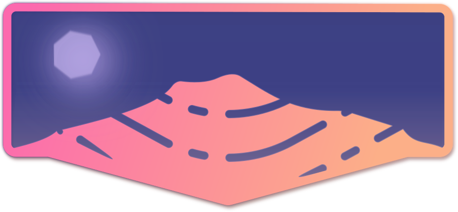

  

# Vesuveus - *Small*, yet *Mighty*, Mechanical Keyboard

Hey there! I present to you the Vesuveus, a small, ergonomic mechanical keyboard! 
It's carefully designed to be your trusty sidekick for every task, whether you're coding, designing, gaming or just having some typing fun.

This little wonder is heavily inspired by the [atreus](https://shop.keyboard.io/products/keyboardio-atreus), the _alice_
and many amazing works of the [community](https://reddit.com/r/ergomechkeyboards). 

  

     
  

## The Design Principles

My fascination with mechanical keyboards has been ongoing since my initial encounter with the incredible works within the keyboard enthusiast community, over the past years I wanted to contribute by designing a keyboard that could serve as the initial stepping stone for many within this community. My goal was to bridge the gap between the familiar and the new, making a user-friendly and approachable option for all keyboard enthusiasts while striking a balance between ___affordability, ergonomics, usability, adaptability___.

Let's dive into the details of the design and see how I've achieved these goals!

  

     
  

## Affordability:

One of the primary concerns associated with ergonomic mechanical keyboards is their price point. I understand that the cost can be intimidating, particularly when you're uncertain whether it will align with your workflow and preferences. That's why I've designed Vesuveus to be a cost-effective option for those who are curious about ergonomic keyboards and want to give them a try.

To get an estimate of your potential costs, consider the following components for your Vesuveus build:

- 42 switches.
- 42 1u keycaps. (You could also use the mx-flat keycap I designed, you can find the STL file in the [files/printables](./files/printables) folder).
- 42 diodes (1N4148).
- 14 circular magnets (8mm x 2mm).
- 1 MCU (I recommend an RP2040-Zero).
- 24 or 22 AWG Wire (or any wire).
- A 3D printed case (PLA or PETG), or the PCB when it becomes available.

My own build costed around 40-50€, but you can achieve an even lower cost if you already have some of these components on hand.

## Ergonomics:

As a full-time computer user, I find myself spending a significant amount of time typing, and I'm sure many of you can relate to that experience. That's precisely why I've prioritized ergonomics and comfort when designing Vesuveus, making it ideal for prolonged typing sessions. I've accomplished this by incorporating the following design elements:

- **Split Halves**: This feature widens the space between the two halves, promoting a more open and relaxed posture for the shoulders.
- **Angled Split**: A 12-degree angle between the split halves minimizes the outward angle of the wrists, reducing strain and discomfort during use.
- **Thumb Cluster & Stagger:**  The 48-degree thumb cluster and the columnar stagger ensure that our hands rest at a natural and comfortable angle. This thoughtful design minimizes stress on your hands and enhances the overall typing experience.

## Usability:

Usability is another key factor I've carefully considered when designing Vesuveus. Much of this focus centers around the keyboard layout, which I've crafted to be as intuitive and user-friendly as possible. Over the past years, I've experimented with various layouts, from 34 to 48 keys, and the 42-key layout has proven to be the ideal balance for me. Let me break it down for you:

- **34 or 36 layouts** are great for programmers and have a minimal footprint. However, they posed challenges when I needed to use mouse-centric apps like Inkscape or PowerPoint. I found myself missing essential modifier keys and an arrow cluster, which drove me to explore other options.
    
  

     
  

  If you are interested in this layout I suggest the [bgkeeb](https://github.com/sadekbaroudi/bgkeeb) from sadekbaroudi and the [Sweep](https://github.com/davidphilipbarr/Sweep) by davidphilipbarr.

- On the other hand, **46 or 48 layouts** felt chaotic and ignored the ergonomic principles I valued. The need to have my pinky finger responsible for pressing 4 to 6 keys was impractical. Despite some creative workarounds, it just didn't feel right to me.

  

      
  

  if you would like something the [Frame-48](https://github.com/gregsqueeb/Frame-48) by gregsqueeb is a great option.

So, this **42-key layout** provides the best of both worlds. It offers usability, comfort, and an efficient use of space. This layout strikes the perfect balance between usability, comfort, and dimensions. Additionally, it retains familiar shortcuts with the placement of modifier keys (CTRL, OS, ALT, etc.), and the arrow cluster is optimally positioned.

What makes this layout truly remarkable is the need to memorize only two layers, which are accessible by holding the thumb central and inner keys. This allows you to access the full 104 keys without shifting the essential keys, such as space, arrows, or modifiers. It's easy to learn and use, making it an excellent choice for those new to the world of ergonomic mechanical keyboards.

  

      
  

  - **Note** - _common 42 layouts_: 
  
    There are other 42 layouts, but instead of placing the 3 switches along the bottom row, the they got an extra pinky column, which as I said before, I don't like. If you are interested in this layout I suggest the [piantor](https://github.com/beekeeb/piantor) from beekeeb.

  - **Note** - _extra pinky_: 

    I think that adding a extra side key for the pinky could be great (see the [TOTEM](https://github.com/GEIGEIGEIST/TOTEM) by GEIGEIGEIST layout) because we are accustomed to stretching the pinky sideways, but this would occupy more space on the desk and on the 3D printer, so I didn't feel to include that in this version. Maybe, in the future there will be a 44 keys version.

  - **Note** - _gaming_:
    
    When it comes to gaming, I've traditionally used the WASD keys for movement. However, due to the compact layout of Vesuveus, I've opted for the ESDF configuration instead. While this choice initially requires some configuration when installing a new game, it allows me to maintain my muscle memory. I experimented with a separate gaming layer but found it disrupted my workflow. This decision aims to preserve usability and minimize the learning curve, making Vesuvius versatile for various uses. Feel free to customize your layout as needed!

## Adaptability:

I've designed Vesuveus to be as adaptable as possible, software and hardware wise. Using KMK the keyboard can be configured to your liking, and the firmware can be easily modified to suit your needs. Also, the keyboard is designed to be compatible with a wide range of switches, keycaps, and other components. This adaptability allows you to customize your Vesuveus to your heart's content, making it a truly unique and personal keyboard.

# Vesuveus in Action
In this video, you can witness satisfying keystrokes of the Vesuveus mechanical keyboard. Please note that the video was recorded with a smartphone, so the quality might not be top-notch, but the typing experience is!

Stay tuned for more videos and pictures of the Vesuveus in action as I continue to explore and improve this little wonder!

# Should You Try Vesuveus?

Hey, if my madness intrigues you, why not give Vesuveus a try? I'd be more than happy to include your contributions or ideas in this project! Feel free to get in touch, and let's make some keyboard magic together! 😄

**TO DO** build guide in the [files/README.md](./files/README.md) file. 